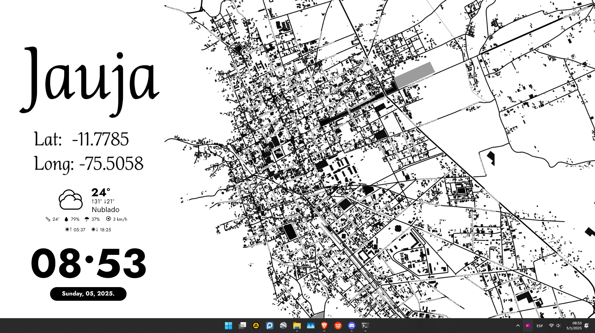

# How to configure the Windows skin?
This repository contains software that you can use to set up your Windows desktop. 🖥️✨

## Software and Plugins

- Terminal 
  - https://ohmyposh.dev/
- Widget
  - https://www.rainmeter.net/
- Plugins
  - https://www.deviantart.com/xenium-art/art/Tiny-Weather-Animated-UPDATED-25-JAN-2023-939250053
- Background 
  - https://www.maptiler.com/
